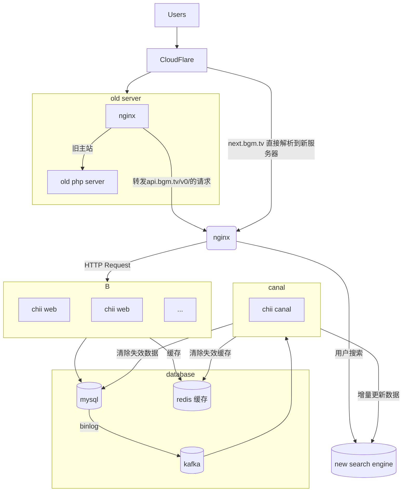

```mermaid
flowchart TD
  Users --> CloudFlare --> Old

  subgraph Old[old server]
    nginx
    nginx --> |旧主站|php[old php server];
  end


  nginx ---> |转发api.bgm.tv/v0/的请求| Nginx(nginx);
  CloudFlare --> |next.bgm.tv 直接解析到新服务器|Nginx;


  Nginx -->|HTTP Request|B;
  Nginx --> |用户搜索|meilisearch;

  C ---> |增量更新数据|meilisearch;

  B --> mysql
  B --> |缓存|redis
  C --> |清除失效缓存|redis
  C --> |清除失效数据|mysql
  kafka --> C;


  subgraph B
    direction BT
    B1[chii web];
    B2[chii web];
    ...
  end

  subgraph C[canal]
    C1[chii canal];
  end

  meilisearch[(new search engine)];

  subgraph Components[database]
    direction BT
    redis[(redis 缓存)]
    mysql[(mysql)]
    kafka[(kafka)]
    mysql --> |binlog|kafka;
  end

```
